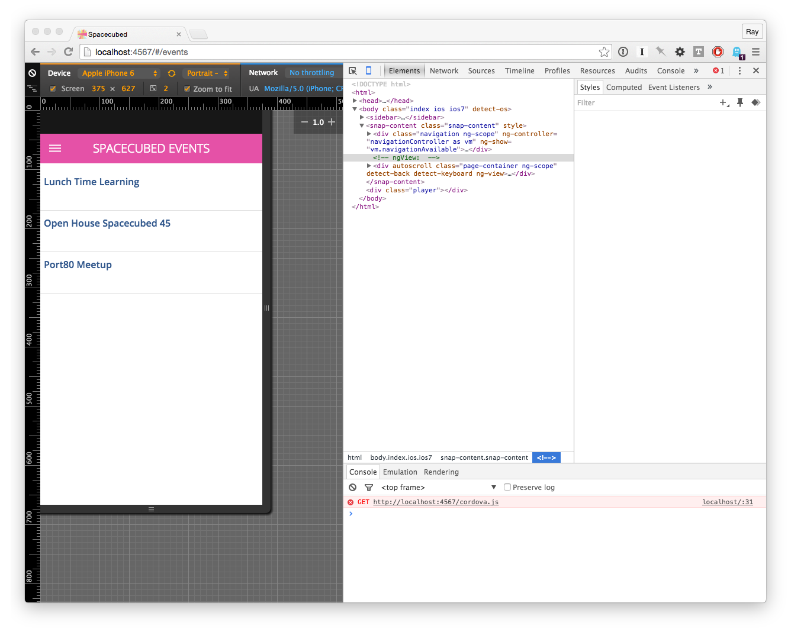

# Development Environment

This playbook uses [Middleman][] to build a static website to the `www` folder and uses [Cordova][] to deploy that static site into native apps for iOS and Android.

## Getting started

### Install XCode

Install it from the Mac App Store. You'll also need to install the command line tools.

### Install Homebrew

```sh
ruby -e "$(curl -fsSL https://raw.githubusercontent.com/Homebrew/install/master/install)"
```

### Install Android Development Environment

Install the Android Development Environment. [These instructions](https://facebook.github.io/react-native/docs/android-setup.html) are decent.


### Install Ruby

Install Ruby 2.2.2 using your favourite version manager. Here are the steps if you want to use [chruby][].

```sh
brew install chruby
```

Add the following to your shell profile:

    source /usr/local/opt/chruby/share/chruby/chruby.sh

```sh
$ brew install ruby-build
$ mkdir -p ~/.rubies
$ ruby-build 2.2.2 ~/.rubies/2.2.2
```

Kick up a new shell and switch to 2.2.2 and install [bundler][].

```sh
$ chruby 2.2.2
$ gem install bundler
```

### Install Node

Install node 4.2.1. Here are the steps using [nvm][]:

`brew install nvm` and add the following to your shell profile:

    export NVM_DIR=~/.nvm
    source $(brew --prefix nvm)/nvm.sh

Kick up a new shell, install, and switch to 4.2.1:

```sh
$ nvm install 4.2.1
$ nvm use 4.2.1
```


### Get Project Dependencies

```sh
$ gem install bundler
$ bundle install
$ bundle exec rake install_tools
```

### Set up your application config

Edit the file `source/config.xml` and set your `id`, `name`, `author`, and `description` to match the app you are making.

### Create Android and iOS app projects via Cordova

```sh
$ bundle exec rake bootstrap
```

## Running your site/app the browser

So for general development you kick up the middleman server and see the results of your work in the browser.

```sh
$ bundle exec middleman server
```

Then browse to `http://localhost:4567` in your browser.

Edit your source files (under the folder `source`), refresh your browser and see your changes.

[Chrome device emulation](https://developer.chrome.com/devtools/docs/device-mode) is handy for development. The emulation isn't perfect however so you will want to test on simulators and physical devices also.



## Running on iOS

Build the site first.

```sh
$ bundle exec rake ios:build
```

Then open up the Xcode project at `platforms/ios/*.xcodeproj`, select the emulator you want and hit the play button.

Similarly you can choose a physical device you've plugged in via USB and run on that.

## Running on Android

It is all wrapped up in a single task:

```sh
$ bundle exec rake android:run
```

If there is an Android plugged in via USB and in debug mode it will install on there otherwise it will choose whatever simulator you have registered in android avd.

## Build Release

TODO

[Middleman]: https://middlemanapp.com/
[Cordova]: https://cordova.apache.org/
[bundler]: http://bundler.io/
[nvm]: https://github.com/creationix/nvm
[chruby]: https://github.com/postmodern/chruby
